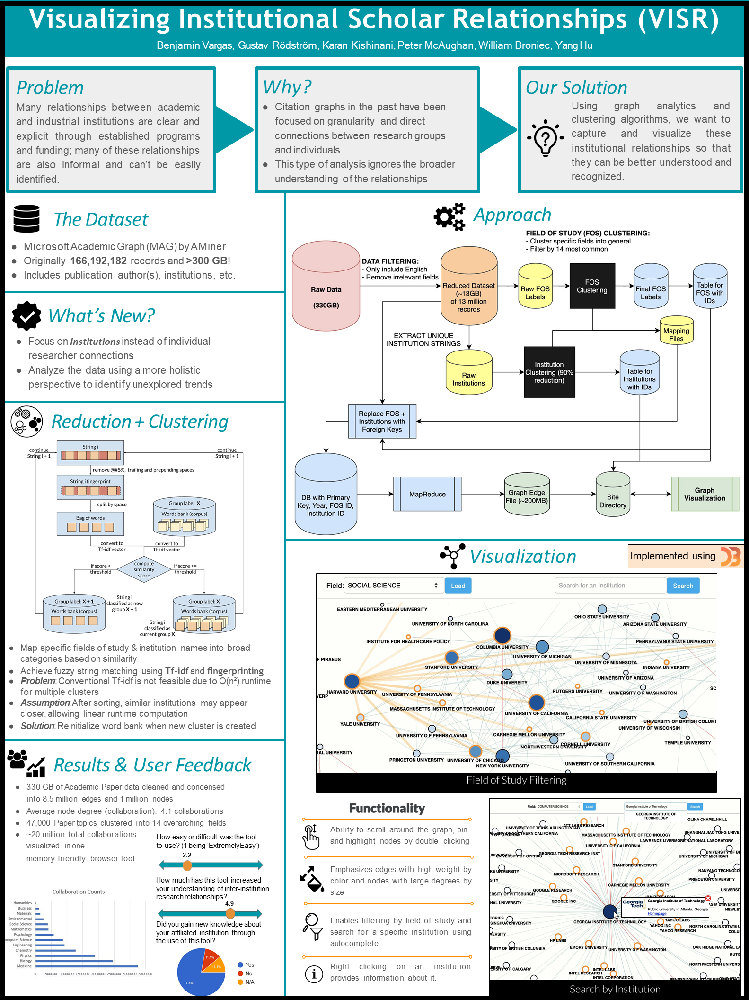

# Visualizing Institutional Scholar Relationships (VISR)

View the project live at [HERE](https://whoyoung388.github.io/visualization-of-schools/.) It will take ~30s to download the data and load the graph. Press the blue "Load" button once the screen is no longer greyed out to display the graph for your selected field of study.

All the code for the project contained in the root directory.

---------------------------------------------------

## Vizualizing the results (Visualization)

### DESCRIPTION
This project folder contains the code and the reduced dataset required to perform the analysis and visualization.  
The clustering and preprocessing code takes an extensive amount of time and is included for reference purposes only
if one desires to reperform our steps or to view how some of the code works. The original MAG file is very large (330GB)
but can be freely found online. It can be found at https://aminer.org/open-academic-graph.

The visualization code is held in the `./viz` folder and can be run mostly out of the box. The instructions to run
the code are included below.

The visualization is meant to be self-contained and thus requires minimal setup. The tool runs in the browser and the
data was drastically compressed such that it fits nicely into the site directory.

### INSTALLATION & EXECUTION
Requirements:
1. A http server. This https://www.npmjs.com/package/http-server was used when testing. Alternatively, a program such as Brackets can be used to run the visualization.
2. A browser

Steps:
1. Navigate to `./viz/`
2. Start the http-server and open graph.html in your browser.

*NOTE:* Some browsers such as Microsoft Edge may not require a server to observe the visualization.

When the HTML file is opened using a server, the data will be loaded which will take several seconds.
After the 'data is loading' message completes, you may select a field of study from the dropdown menu
and press the 'load' button to generate an interactive graph. If you would like to search for connections
for a specific institution for a given field, you can enter the name in the search box and press the
search button to generate the graph. Autocomplete will help you determine if your search string is correct
and included in the database of institutions.

---------------------------------------------------

## BELOW WE PRESENT INSTRUCTIONS FOR RUNNING ALL OTHER CODE USED FOR CLUSTERING THE DATA (optional)

*NOTE:* This process takes time to run, if you just want to observe the final visualization, just running the code from the previous section should be sufficient.

### Data Files to Download

#### Raw Unique Institution Names

Download: https://drive.google.com/file/d/1lKwpA3zjHrVqNqjMds_jAscbyeL4i-Qb/view

#### Clustering of the Institution Names

This process operated off the original data file to get a list of fields by paper.

Because of the severe size & time required to set this up, we have replicated the
final step of this which is the simplification from specific fields to the general
13 that we constructed.

Download: https://drive.google.com/file/d/1doD_s5MXSSc0jFReCaajA_j_4sEiTXJC/view

### Steps for Running Clustering

Requirements:
1. Python 3 with Packages: NumPy, Pandas and Sklearn
2. Jupyter Notebook

Steps:
1. Navigate to DVA6262_GroupProject/
2. Run the clustering notebook via jupyter notebook clusters.ipynb
3. Set the input_filename variable to the path to the unique institution names.
4. Set the mapping_filename and label_filename to anything. Make sure that the path to the files exist.
5. Run the cells.

### Steps for Mapping the Fields of Study

Requirements:
1. Python 3

Steps:
1. Navigate to DVA6262_GroupProject/fos/
2. Run script via python map.py simplified_fields.txt > $output_file
3. Field names are converted to ID values specified in FOSIDMAP.txt via bash script replace.sh

This output is merged with the institution data and sent to Hadoop MapReduce

